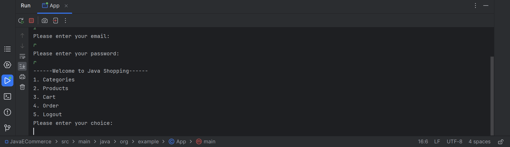
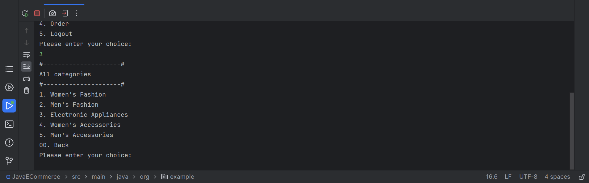
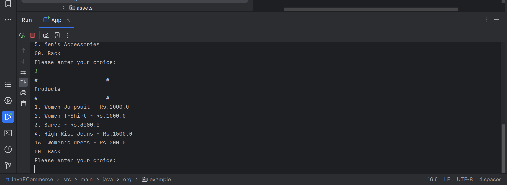
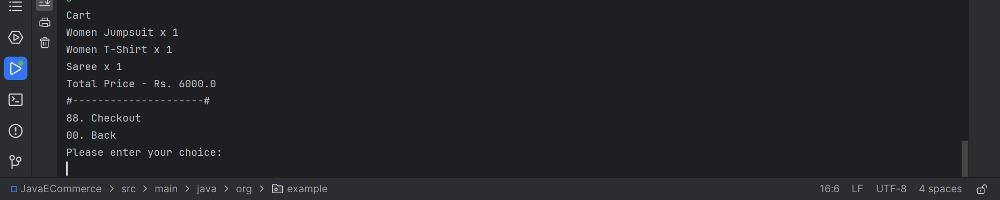

# E-COMMERCE APPLICATION USING JAVA

This project is developed using JAVA V-17.0.8.

Text editor used: INTELLIJ .

Project: Maven based project.

## 🛠 Skills
------------
Core Java

OverView of the project:
-----------------------
    Here, user can login or register into the application, shop products they want to add to the cart,while checkout user get an invoice of their orders.

    Also, admin can login into the application , and can perform all CRUD operation with the products and can view User details and user's orders.   

------------------------------------------------

## CHALLENGES AND DEFECTS FACED:

1.Faced issue in File handling:
    
       Before working with this project, I just only know how to read a text file and how to write a text file.

       While working on this project for me it seems hard to work in CSV files.
   
       CSV file writer and reader issue:

       Whenever, I can convert a ArrayList into a CSV file, it write the content with double quotes("").SO, to remove that quotes I used 
       [CSVWriter.NO_QUOTE_CHARACTER,CSVWriterDEFAULT_ESCAPE_CHARACTER,CSVWriter.RFC4180_LINE_END] inbuilt functions .

2.Setting and getting categories for products from CSV file:

        At first, I can't set category for the project object, also I can't retrieve the arraylist from the method.

        So, I coded the logic in single method from that I returned the arraylist for displaying to the user.

        And for each project in the arraylist, I set the category object, so that it can accessed easily.
3.While doing logic part for edit operation:

        Whenever I do edit part the entire file got erased and my edited object alone got printed.

        To rectify that part, I read the entire file using CSVReader and I stored it as List of strings, 
        using get() method I get the particular index to make the changes without affecting the rest of the objects.

      

   

## PROJECT IN MVC MODEL
📋Models:                  
  - ➡️Admin
  - ➡️User
  - ➡️Cart
  - ➡️Cartproduct
  - ➡️Order
  - ➡️Product
  - ➡️Category

📋View:
  - ➡️Admin page
  - ➡️Auth page
  - ➡️Cart page
  - ➡️Login page
  - ➡️Register page
  - ➡️Home page
  - ➡️Category page
  - ➡️Orders page

📋Controller:
  - ➡️Admin Controller
  - ➡️Auth Controller
  - ➡️Home Controller
  - ➡️Cart Controller
  - ➡️Order Controller
  - ➡️Category Controller
  - ➡️Product Controller

## FEATURES OF THE PROJECT

1.📋USER SIDE:
   - Login
   - Register
   - View Categories
   - View Products based on Categories
   - View all products
   - Add the products to the Cart 
   - View cart page
   - Checkout 
   - Generate invoice for order.

2.📋ADMIN SIDE:
   - Login
   - Products 
       - Display Products
       - Add product
       - Delete product
       - Update product
   - Categories
       - Display Categories
       - Add Categorie
       - Delete Categorie
       - Update Categorie
   - View User details
   - View Orders placed

## ROADMAP TO RUN THE APPLICATION:

Working
--------
1.Working of user side:
----------------------
 Step-1: If you are a new user , you need to register using the option provided.After registeration you have to login in to the application.
 
 Step-2: If you want to view products based on categories, then click on categories options from that click on which category you want to view.
 
 Step-3:After viewing all the products , click on option on the product which you want, so that you can add the products to the cart.
 
 Step-4:For each time you want to get back to the previous menu, click on back option.
 
 Step-5:After adding products into the cart, Click in checkout option providedin the cart page,
 after checkout user will receive a invoice of their orders.

 2.Working of admin side:
 ------------------------
 Step-1:Admin has to login into the application to perform any operation.

 Step-2:Admin can view all categories and can perform CRUD operations .

 Step-3:Admin can view all products and can perform CRUD operations .

 Step-4:Admin can view all user details.

 Step-5:Admin can view orders of the users.

##SCREENSHOTS:
--------------
LOGIN PAGE:

HOME MENU:

CATEGORY MENU:

PRODUCTS BASED ON CATRGORY:

CARTPAGE:

